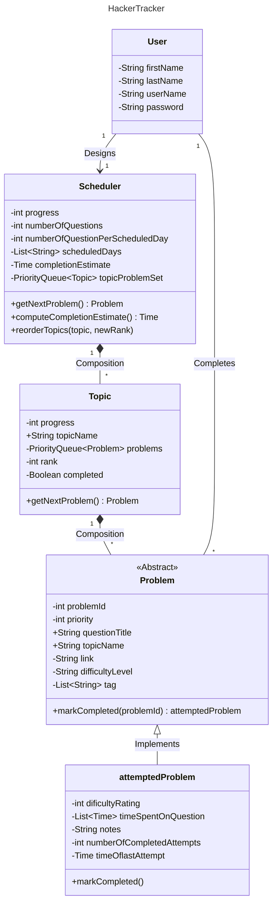

# 🗓️ HackerTracker

HackerTracker aims to simplify the organization process involved in the practice of DSA questions. The goal is to create a software program that can simplify performing the four pillars of the following strategy:

1. Practice the questions regularly over an extended period

2. Solve the problems using a brute force approach first (worst / costly complexity), then attempt to find the efficient approach (best / acceptable complexity)

3. Make a note of the type of optimization required for each type of problem (identify the
recurring patterns per topic)

4. Complete the questions topic wise (focus on one topic at a time)

<br>

# 👥 Contributors

	• Daniel Klevak – klevak.d@northeastern.edu
	• Kavin Jha – jha.kav@northeastern.edu
	• Sarthak Mallick – mallick.sar@northeastern.edu
	• Dany Sigha – nohonetsigha.d@northeastern.edu
	
<br>

# ❗ Problem Statement

For students, and really for all professionals in the Software Development industry, the job search process requires a methodical and sustained practice of Data Structures and Algorithms questions (hereinafter referred to as DSA questions) to better retain the concepts.These questions can be found on resources such as Leetcode, HackerRank, CodeForces, etc... 

Practicing DSA questions is a grueling process for both novice and experienced professionals. It is a well-known fact that many developers, regardless of their level of experience in the industry, dread having to go
through the job search process because of the difficulty of consistently practicing DSA questions over an extended period. Developing an understanding of Data Structures and Algorithm concepts is difficult because it is necessary to adopt a strategy to learn them.

<br>

# ✨ HackerTracker Key features

HackerTracker simplify the organization involved in the practice of DSA questions with the following features:

1. Send a reminder (frequency at the discretion of the user) to practice questions regularly

2. Suggest to the user questions from the well-known top 150 Leetcode questions list

3. Keep track of questions that were solved

4. Provide the user interface necessary to record personal notes related to each question including but not limited to: time spent on question, a personal rating of question difficulty, algorithm used to solve the problem, and optimizations used to achieve better efficiency

5. Use a formula to determine if/when to suggest a question that was already solved by the
user to further strengthen their understanding

6. At user discretion, indicate the pattern the user may want to follow to solve each question
(i.e.: sliding window, two pointers, etc.)

7. Show a progression visualization of the number of questions completed

8. Estimate dynamically the time required to complete all the questions based on the frequency of question completion set by the user, and the questions marked as completed

9. Enable user to mark any question as completed at any time, although the suggestionshould focus on a per topic approach

10. Enable the user to define the order in which the program selects topics for the questions which are suggested

<br>

# 🛠️ Technology Stack and programming concepts

	• JavaFX and MaterialFX
	• Eclipse
	• Scene Builder
	• Maven
	• Class definition
	• Inheritance
	• Abstract classes
	• Lists
	• Priority Queues
	
<br>

# Object model



<br>

# 📖 Usage Guide

Adding/Updating your schedule

	1.	Select the gear icon on the main screen
	2.	Select a day of the week on the left view
	3.	Specify the number of questions on the right view
	4.	Specify a topic on the right view

Completing questions

	1.	Open the link to the question
	2.	Complete the question
	3.	Use the checkbox to mark question as completed

View you progress

	1.	Select the progress bar icon
	2.	Navigate through the milestones to view number of questions completed

<br>

# 👩🏼‍💻 Development Setup

Prerequisites

	•	JavaFX
	•	SceneBuilder (for UI development)
	•	Maven (for package management)
	•	MaterialFX (for modern UI)
	•	Eclipse
	

Local Setup

1.	Clone the repository:
```bash

git clone https://github.com/username/HackerTracker.git
cd HackerTracker
```

2.	Install dependencies:
    1. Install Eclipse
    2. Install Maven
    3. Install MaterialFX

3.	Run the project:

    Click "run" in eclipse in the MainPage.java

<br>

# 📝 License

This project is licensed under the MIT License - see the LICENSE file for details.


